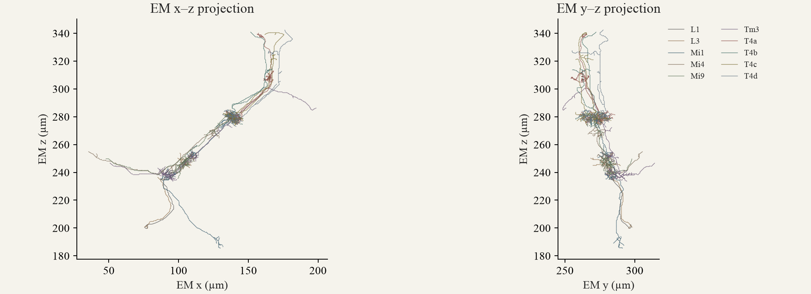
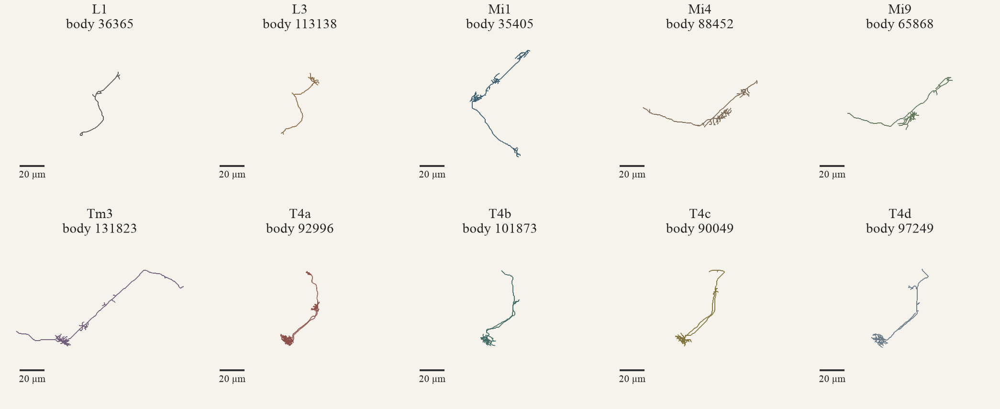
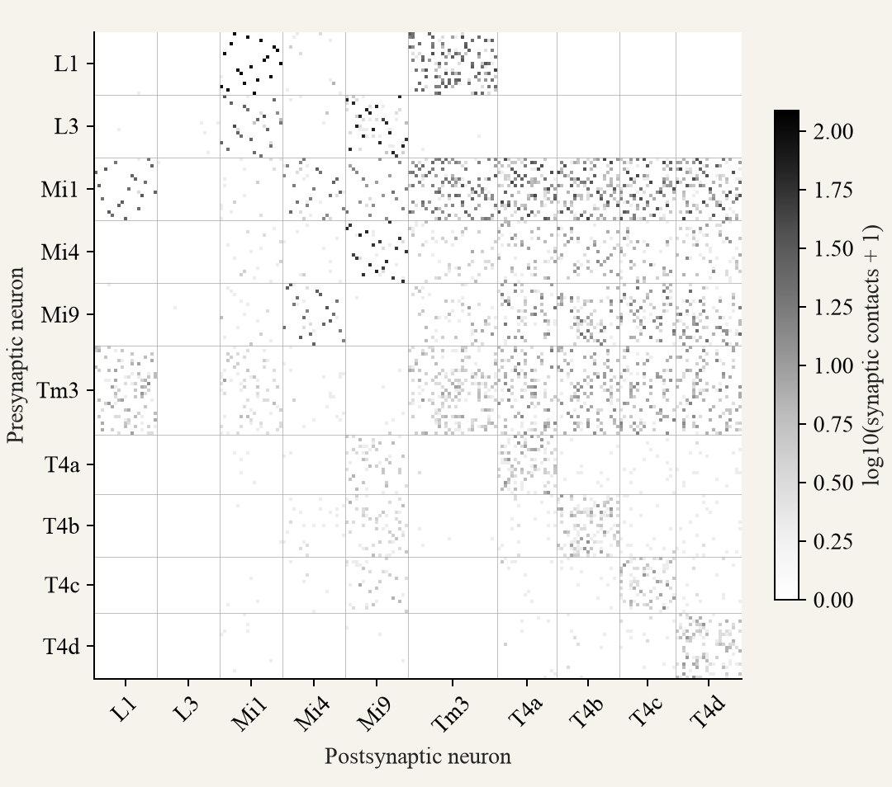
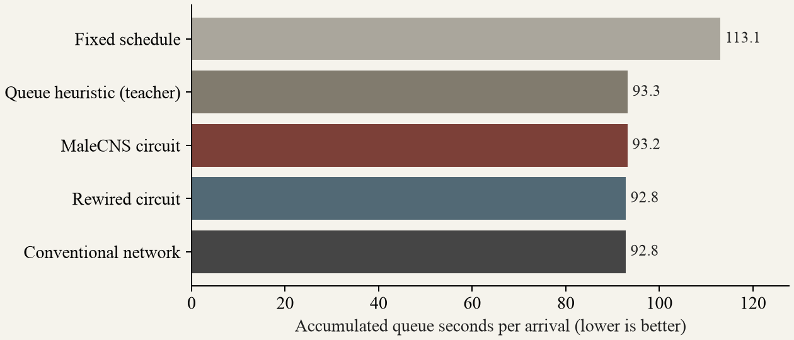
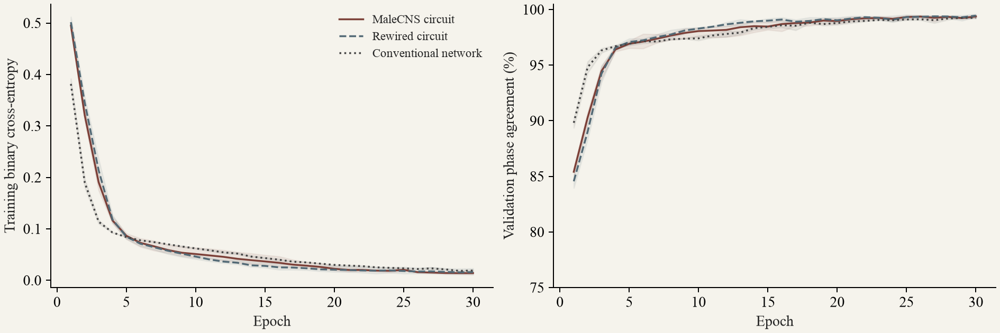
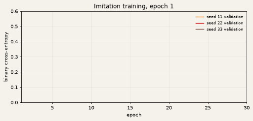
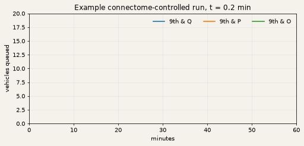

# Lincoln traffic control experiment

Steps are given to reproduce below, once finished run `python3 -m http.server 8000` for the completed report and simulation playback. All data required for display are embedded; no external services or tracking are used.

Following the release of the open sourced fruit fly brain map by <a href=https://research.google/blog/a-connectomics-milestone-mapping-the-complete-male-fruit-fly-brain/>Google</a>, I became interested in diving into it. Now my attempt and approach may seem crude or unrefined, and this is largely due to the fact that much of the heavy lifting was outsourced to an agent, as I have no formal education in AI models or machine learning. So, this repository is just a compact computational experiment linking a small, anatomically constrained neural circuit to a simplified traffic-signal task in Lincoln, Nebraska (go huskers). The interface is a companion to the methods and results below. 


## Question

Can a small connectome-constrained neural network learn to request sensible traffic-signal phases in a hypothetical Lincoln post-game queue model?

The answer for this experiment is yes, by **supervised imitation** of an explicit queue heuristic. This is not reinforcement learning, and the test does not establish a benefit from biological wiring. The measured and rewired circuits, conventional network, and heuristic perform similarly.

## Measured results

Queue seconds per arrival (means over 20 traffic seeds and, for learned models, three training seeds):

| Controller | Standard | Higher event demand | Shuttle assumption | P restriction |
|---|---:|---:|---:|---:|
| Fixed schedule | 113.06 | 189.49 | 66.56 | 370.86 |
| Queue heuristic | 93.26 | 148.52 | 65.76 | 286.73 |
| MaleCNS circuit | 93.20 | 147.34 | 64.50 | 285.65 |
| Rewired circuit | 92.84 | 146.09 | 64.04 | 284.09 |
| Conventional network | 92.82 | 147.49 | 64.11 | 283.93 |

Standard-scenario reduction against the illustrative fixed schedule: **17.6%** (paired bootstrap 95% interval **14.7–20.3%**). This interval quantifies variation among simulated traffic seeds, conditional on the model. It does not quantify uncertainty about actual Lincoln traffic. See `results/REPORT.md`, `results/metrics.json`, and `results/summary.csv`.

## Data and anatomy

- Signal names and coordinates come from the City of Lincoln/Lancaster County public GIS layer: <https://gis.lincoln.ne.gov/public/rest/services/LTUTraffic/TrafficSignals/MapServer/3>. Only the three junctions 9th & Q, 9th & P, and 9th & O are modeled. Lines connecting them in the figure are schematic; no road geometry or traffic counts were imported.
- The 196-neuron, 2,966-edge MaleCNS v1.0 subgraph contains 21,984 summed synaptic contacts and ten neuron types from the right optic lobe. Edges to neurons outside this selected set are omitted. The compact CSV tables in `data/` are the exact circuit subset used here.
- Ten real SWC skeletons, one representative neuron for each type, are shown in Figures 1 and 2. Their body IDs occur in the modeled circuit. SWC coordinates use 8 nm units and are converted to micrometers. The individual-cell panels share a common scale with 20 µm scale bars. Morphology is displayed for context and does not enter the model equations.
- Dataset: [MaleCNS v1.0 download and documentation](https://male-cns.janelia.org/download/). Attribution: FlyEM/HHMI Janelia, University of Cambridge, MRC Laboratory of Molecular Biology, and Google Research. The dataset is CC BY. City signal locations are attributed to Lincoln/Lancaster County GIS. `data/provenance.json` records skeleton source URLs, IDs, and SHA-256 hashes. The source neuron and edge tables are included in `data/`.
- Current game-day arrangements are not reproduced. [Official Husker football game-day information](https://huskers.com/football-game-day-information) is linked for general context only.

### Circuit overview



Figure 1. The colored traces are reconstructed neuron skeletons projected into two coordinate planes. Color denotes cell type. The sample is a deliberately small optic-lobe subgraph rather than a full-brain simulation.



Figure 2. Sample morphology for L1, L3, Mi1, Mi4, Mi9, Tm3, and T4a through T4d. Each panel shows a neuron that is actually represented in the circuit table.



Figure 3. Directed contact counts between presynaptic and postsynaptic neurons, grouped by cell type. Color shows `log10(contact count + 1)`. The connectivity is anatomical. The network's effective signs and dynamics are modeling choices described below.

## Traffic model

Three intersections lie in a southbound corridor. Each has one aggregate corridor queue and one aggregate cross-street queue. All corridor traffic transfers to the next intersection, then leaves after O Street; all cross-street discharge leaves the network. No turning routes are modeled.

Time step is 10 seconds; each episode lasts 360 steps (60 minutes). Arrivals end after 180 steps. For step `t < 180`, the upstream event arrival rate is `5.5 * exp(-((t-45)/43)^2) * demand * (1-shuttle)` vehicles per step, added to 0.8 background corridor arrivals. Other rates are 0.3 for the corridor at P and O, and 1.3, 1.6, and 1.5 for the three cross-street queues. Each rate receives independent uniform 0.9–1.1 jitter per step, followed by Poisson sampling. These rates are assumptions.

Default discharge capacity is 8 vehicles per active movement per step. The restriction scenario halves P Street's corridor capacity. Upstream movement is blocked if the next corridor queue has reached a 60-vehicle receiving threshold. Exogenous arrivals may push queues above that threshold; vehicles are retained and never silently dropped. Discharges are simultaneous and transferred vehicles become available downstream on the next step. The transfer delay is not calibrated from physical distance.

Every controller uses the same guard: minimum 20 seconds green, maximum 80 seconds when the conflicting queue is nonempty. A change incurs one whole 10-second clearance step with no service. Fixed timing requests a synchronous 80-second cycle (50 seconds corridor, 30 seconds cross), subject to that same guard. It is not Lincoln's actual timing plan.

The reported metric is `sum(post_step_total_queue * 10 seconds) / total_arrivals`, including vehicles still in queues. All evaluated episodes in this run finish empty. It is a discrete queue-time measure, not total trip time or a calibrated per-vehicle delay. Conservation is asserted after every simulation step.

The teacher compares corridor pressure `max(corridor_queue - 0.7 * downstream_queue, 0) * corridor_capacity / 8` against the cross-street queue and adds 4 to the currently active movement. It selects the larger score. This simple engineering rule is not claimed to be an optimal controller or an implementation of a published max-pressure theorem.

### Update equations

Let `q[i,m,t]` be the queue at intersection `i`, movement `m`, and step `t`; let `a[i,m,t]` be sampled arrivals and `f[i,m,t]` be discharged vehicles. Queue conservation is:

$$q_{i,m,t+1}=q_{i,m,t}+a_{i,m,t}-f_{i,m,t}+r_{i,m,t},$$

where `r` is the transfer from the previous intersection for the corridor movement, and zero for cross streets and the upstream node. Flow is capped by the active movement's service capacity and by the next queue's receiving space. Transfers are applied simultaneously and become available downstream in the following step. Every step asserts that accumulated arrivals equal departed vehicles plus vehicles still queued.

The reported outcome is the discrete queue-time average:

$$D_q=\frac{\Delta t\sum_{t=1}^{T}\sum_{i,m}q_{i,m,t}}{N_{\mathrm{arrivals}}},\qquad \Delta t=10\ \mathrm{s}.$$

This is accumulated queue seconds per arrival. It counts residual vehicles in the queue at each step and is not calibrated trip delay or measured travel time.



Figure 4. Static cross-controller comparison for the standard scenario. Each bar is a mean over the paired evaluation traffic seeds. The complete four-scenario table is given below and in `results/summary.csv`.

## Neural model and training

Observation has 15 values: six queue lengths divided by 60 and clipped at 4, three binary current phases, three green ages divided by 8 and clipped at 1, and three corridor capacities divided by 8.

A learned 15-to-38 affine adapter drives L1 and L3 neurons. The circuit performs eight recurrent updates from zero for each decision:

`h[k+1] = (1-alpha)*h[k] + alpha*tanh(W*h[k] + drive + bias)`.

The initial absolute edge weight is 1.5 times the anatomical contact count divided by total retained incoming contacts. A trainable positive multiplier `exp(clamp(edge_scale,-2,2))` changes its magnitude. Transmitter-derived signs are fixed: acetylcholine positive, GABA/glutamate negative. These signs are approximations and omit receptor-specific effects. Type-level leak factors and biases are learned. A linear 74-to-3 readout takes the individual T4 states. There is no direct input-to-output shortcut. The model has 3,819 parameters and does not use the parent motion model's trained weights.

Training uses 90 synthetic episodes (240 observations each = 21,600 examples), with separate data-generation seed 4101. Episodes alternate teacher, fixed and random behavior policies. Demand scale varies uniformly from 0.65–1.35, event reduction from 0–0.3, and P capacity among 0.5, 0.75, and 1. Validation uses 18 separate episodes (4,320 observations) from seed 4102. Splits are by generated episode rather than adjacent timesteps.

For model initialization/training seeds 11, 22 and 33, train 30 epochs with Adam at 0.003, batch size 256, gradient clipping at 1, and binary cross-entropy against three teacher decisions. Select the lowest validation-loss checkpoint. The same settings and examples apply to all networks. No hyperparameters were changed after inspecting final evaluation scores.

The control graph uses directed double-edge swaps within cell-type pairs. Every neuron's in/out degree, type-pair identity, self-loops, edge count, source-associated count multiset, and parameter count are preserved. Weighted incoming sums and spatial locality are not preserved. The conventional network has two 64-unit tanh hidden layers and 5,379 parameters; it is not parameter-matched. All use the same input features and timing guard.

Evaluation uses traffic seeds 5100–5119 in four scenarios. All controllers in each scenario receive identical arrivals. Scenario names describe changes in expected demand; Poisson realizations can differ across scenarios. Three model seeds are averaged within each traffic seed before bootstrapping 20 paired traffic seeds (5,000 replicates, bootstrap seed 6020). Scenarios are within the training range; no out-of-distribution claim is made.

The browser displays stored traces from traffic seed 5100 and policy seed 11, selected in advance. It does not run inference or retrain while playing. Reported evaluation means use all seeds, not just the visible example.

### Circuit dynamics



Figure 5. Training loss and validation phase agreement for the connectome, rewired graph, and conventional network. The connectome model has 3,819 trainable parameters. Its 196 modeled neurons are recurrent internal state units, and a separate readout emits the three intersection phase requests.

The state update is a leaky, signed recurrent unit. For neuron `j` and recurrent iteration `k`:

$$h_j^{(k+1)}=(1-\alpha_j)h_j^{(k)}+\alpha_j\tanh\left(\sum_i W_{ji}h_i^{(k)}+u_j(x)+b_j\right),$$

where `x` is the 15-value traffic observation, `u(x)` is an input adapter that drives L1 and L3 units, `b_j` is a learned cell-type bias, and `alpha_j` is a learned cell-type leak in the interval `(0.05, 0.95)`. The initial state is zero and eight recurrent updates are computed for each decision. The T4a through T4d neuron states feed a linear three-output decoder.

For an anatomical edge from presynaptic cell `i` to postsynaptic cell `j`, the starting magnitude is proportional to its contact count and normalized by total retained input contacts to `j`. A trainable multiplicative factor adjusts it:

$$W_{ji}=1.5\frac{c_{ij}}{\sum_r c_{rj}}s_i\exp(\operatorname{clip}(\theta_{ij},-2,2)).$$

Here `c` is the aggregated synapse count, `s_i` is a fixed transmitter-derived sign, and `theta` is learned. Acetylcholine is modeled as positive and GABA or glutamate as negative. These broad signs ignore receptor-specific effects, cotransmission, and synaptic dynamics, so they should be read as coarse assumptions, not biophysical measurements.

### Imitation objective

This experiment uses supervised imitation, not reinforcement learning. The teacher's binary phase recommendation at each junction is the target. With logits `z` and targets `y`, training minimizes mean binary cross-entropy:

$$\mathcal{L}(z,y)=-\frac{1}{3B}\sum_{b=1}^{B}\sum_{i=1}^{3}\left[y_{bi}\log\sigma(z_{bi})+(1-y_{bi})\log(1-\sigma(z_{bi}))\right].$$

Training examples are generated from synthetic episodes, not city sensors. Episodes alternate between teacher-controlled, fixed-schedule, and random-action behavior so that the targets include states away from the teacher's own trajectory. The held-out split is made by episode with separate generation seeds, avoiding a random timestep split of highly correlated trajectories.



Figure 6. Training and validation binary cross-entropy for the three connectome training seeds. Frames reveal the history accumulated through each epoch. This is a GIF of saved metrics, not a new training run.

## Evaluation details

### Scenarios and paired test design

The four test scenarios are the standard 30-minute pulse, 25% higher assumed event demand, a 25% demand reduction called the shuttle assumption, and a 50% reduction in P Street corridor discharge. The latter three change one simulation parameter at a time. These are model stress tests, not descriptions of measured Husker game operations.

Each of the five controllers sees identical generated arrivals within a given traffic seed and scenario. Evaluation uses traffic seeds 5100 through 5119. Each learned model type has three independent training seeds, 11, 22, and 33. The reported learned-model value averages those model seeds within each traffic seed before comparing traffic-seed pairs. Therefore, the bootstrap unit is the traffic seed, not an individual timestep or model run.

### Results by scenario

Mean queue seconds per arrival, lower is better. Values are averaged over 20 traffic seeds; learned controllers also average three training seeds.

| Controller | Standard | Higher demand | Shuttle assumption | P restriction |
|---|---:|---:|---:|---:|
| Illustrative fixed schedule | 113.06 | 189.49 | 66.56 | 370.86 |
| Queue heuristic teacher | 93.26 | 148.52 | 65.76 | 286.73 |
| MaleCNS circuit | 93.20 | 147.34 | 64.50 | 285.65 |
| Rewired circuit | 92.84 | 146.09 | 64.04 | 284.09 |
| Conventional MLP | 92.82 | 147.49 | 64.11 | 283.93 |

Against the illustrative fixed schedule in the standard scenario, the MaleCNS controller's paired mean reduction is 17.6%. A 5,000-replicate paired bootstrap over the 20 traffic seeds gives a 95% interval of 14.7% to 20.3% (bootstrap seed 6020). This interval is conditional on the simulation and its chosen parameterization. It says nothing about real-world traffic uncertainty.

The static comparison plot above shows the standard-scenario means. Similar results for the connectome, rewired circuit, and MLP do not support a claim that biological wiring is especially effective for this task. The MLP uses 5,379 parameters, so it is not parameter matched; the rewired model is the graph control with 3,819 parameters.

### Example trace animation



Figure 7. Total corridor plus cross-street queues at 9th & Q, 9th & P, and 9th & O during one preselected, stored standard-scenario run (traffic seed 5100, connectome training seed 11). This is a single illustration. It is not used as the aggregate result.

### Neuron ablations

The seed-11 circuit was re-evaluated after zeroing selected neuron states at every recurrent update. Mean standard-scenario queue seconds per arrival over the same 20 traffic seeds were 92.97 with no ablation, 91.37 when Mi1 was silenced, 91.22 for Mi4, 91.02 for T4a, and 130.14 when all T4 neurons were silenced. The change after removing all T4 state is consistent with the model's readout depending on the T4 population. These artificial state interventions do not establish causal function in a living fly.

## Interpretation and scope

The result answers a narrow engineering question: can an anatomically constrained recurrent graph imitate a queue-based policy in a small synthetic task? In this setup it can, and its score is close to the teacher. The comparison among connectome, degree-preserving rewiring, and MLP does not show an advantage unique to the measured wiring. The policy training supplies the useful behavior through labels; anatomy constrains the route and parameterization through which the model approximates it.

The underlying MaleCNS is a reconstructed wiring diagram. A wiring diagram alone does not specify a complete biological controller. The current model substitutes simple recurrent rate dynamics, rough transmitter signs, a designed input projection, and a designed output readout for measured physiology. The traffic task is also unrelated to the fly's natural behavior. Thus the result is a demonstration of graph-constrained imitation learning, not a literal fly brain controlling Lincoln infrastructure.

No actual traffic volumes, signal phase timing plans, road travel times, turning movements, pedestrian flows, vehicle classes, real game-day closures, or bus/shuttle schedules were used. The locations are real, while traffic rates and control assumptions are invented for a reproducible toy model. No timing recommendation or travel forecast follows from these runs.

## Reproduce

The source code and all circuit files now live in this repository. From the repository root, create an environment and install the pinned packages:

```sh
python3 -m venv .venv
. .venv/bin/activate
python -m pip install -r requirements.txt
python -m unittest test_traffic -v
python train.py
python figures.py
python make_gifs.py
python build.py
```

Training re-runs the three training seeds, all test scenarios, ablations, and trace export. It can take a few minutes on a laptop. Figure and page generation use the resulting files. These commands overwrite files in `results/` and the generated figures. The browser report itself is a standalone HTML file and can be viewed without installing Python packages.

Five numerical tests cover vehicle conservation, nonnegative queues, phase clearance and minimum green, spillback, deterministic seeded arrivals, and the absence of a direct neural input-to-output shortcut. A browser check also passed for image loading, scenario and controller selection, playback, reset, end-of-run conservation, ablation tables, and mobile overflow. It reported no JavaScript errors. Screenshots and `results/browser-check.json` are included. Optional browser verification needs Playwright and a Chromium browser, then run `python check_browser.py`.

## Files

| File | Contents |
|---|---|
| `traffic.py` | Traffic dynamics, assumed arrivals, teacher and fixed policy |
| `train.py` | Three model structures, imitation training, paired evaluation and ablation |
| `figures.py` | Anatomical skeleton and connectivity plots |
| `make_gifs.py` | Small GIF exports from saved training and simulation traces |
| `connectome.py` | Local CSV loading and degree-preserving graph rewiring |
| `build.py`, `template.html` | Plain HTML report and quantitative summaries |
| `data/training.npz` | Actual training/validation observations and targets |
| `data/*.swc` | Ten real neuron skeletons |
| `results/*_11.pt`, `*_22.pt`, `*_33.pt` | Nine trained checkpoints |
| `results/traces.json` | Recorded demonstrations for all four scenarios and five controllers |
| `results/metrics.json` | Per-seed metrics, histories, and ablations |
| `results/summary.json`, `summary.csv` | Aggregated results and paired interval |
| `results/*-desktop.png`, `report-mobile.png` | Browser-check captures of the report and simulation |
| `figures/*.png`, `*.svg`, `*.gif` | Exportable scientific figures and recorded animations |

## Limits

This is an uncalibrated proof of concept. It omits turning movements, individual lanes, pedestrian timing, traffic officers, actual closures, variable travel times, realistic sensors, and bus operations. Its selected corridor and parameters are for experimentation. No result supports a real signal timing change, a game-day travel prediction, or a claim that fly anatomy is particularly suitable for traffic control.

## References and attribution

- FlyEM, HHMI Janelia, University of Cambridge, MRC Laboratory of Molecular Biology, and Google Research. [MaleCNS v1.0 dataset and download instructions](https://male-cns.janelia.org/download/). Dataset license: [Creative Commons Attribution 4.0](https://creativecommons.org/licenses/by/4.0/).
- Berg et al. [Sexual dimorphism in the complete connectome of the Drosophila male central nervous system](https://pmc.ncbi.nlm.nih.gov/articles/PMC12636603/). The article describes the dataset context and methods.
- City of Lincoln Traffic Operations. [Lincoln/Lancaster County Traffic Signals GIS service](https://gis.lincoln.ne.gov/public/rest/services/LTUTraffic/TrafficSignals/MapServer). Only the intersections for 9th & Q, 9th & P, and 9th & O are used here. The GIS records support location only, not traffic counts or timing plans.
- [Official Nebraska football game-day information](https://huskers.com/football-game-day-information) is linked for context. No game-specific event traffic measurements were available to or used by this model.

The connectome subset and derived neuron illustrations in this repository retain the source dataset's attribution requirements. The traffic simulation, training code, and report describe a separate research prototype. City GIS data are credited to the City of Lincoln/Lancaster County, Nebraska. The contents of this repository are not an endorsement by either data provider.

## Run the site

The finished report and simulation playback are in [`index.html`](index.html). Open that file in a current browser, or serve the repository root locally:

```sh
python3 -m http.server 8000
```

Then open <http://localhost:8000/>. The HTML includes its display assets and stored data, so the core report does not need a backend, internet access, a model download, or a training run. The GIFs and research figures referenced by this README are separate repository files. To rebuild the report after changing code or results, follow the [reproduction steps](#reproduce).
